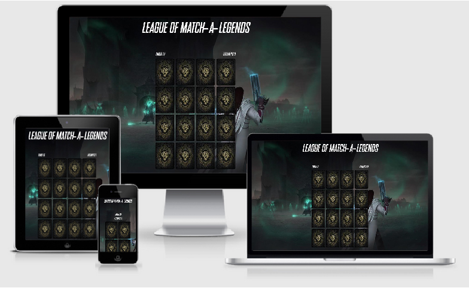

<h1 align="center">League of Match-a-Legends card game</h1>

[View the live project here.](https://andrerafaelf.github.io/MS2-project/)

This is a memory game set to improve brain functionality, concentration and focus.

<h2 align="center"></h2>

## User Experience (UX)

-   ### User stories

    -   #### First Time Visitor Goals

        1. As a First Time Visitor, I want to easily get to the game and start playing.
        2. As a First Time Visitor, I want to keep track of how many moves I've made and in how much time.

    -   #### Returning Visitor Goals

        1. As a Returning Visitor, I expect a game that's refreshing and helps me work my memory.
        2. As a Returning Visitor, I want to be able to make suggestions regarding the game and how to improve it.

    -   #### Frequent User Goals
        1. As a Frequent User, I'm looking for further updates on the game.
        2. As a Frequent User, I'm looking for new and harder challenges to the game (new levels).
        3. As a Frequent User, I'm looking for other types of mind challenging games made by the developer.

-   ### Design
    -   #### Colour Scheme
        -   The two main colours used are dark green and black.
    -   #### Typography
        -   The SNES Italic font is the main font used throughout the whole website with Sans Serif as the fallback font in case for any reason the font isn't being imported into the site correctly. Montserrat is used as a secondary font for sections of the contact page and the footer with Sans Serif as the fallback font too.

*   ### Wireframes

    -   Desktop Wireframe 1 - [View](assets/images/desktop1.png)
    -   Desktop Wireframe 2 - [View](assets/images/desktop2.png)

    -   Tablet Wireframe 1 - [View](assets/images/tablet1.png)
    -   Tablet Wireframe 2 - [View](assets/images/tablet2.png)

## Features

-   Responsive on all device sizes

-   Interactive elements

-   Start, Defeat and Victory game overlay

-   Timer

-   Attempts counter

### Languages Used

-   [HTML5](https://en.wikipedia.org/wiki/HTML5)
-   [CSS3](https://en.wikipedia.org/wiki/Cascading_Style_Sheets)
-   [JS](https://en.wikipedia.org/wiki/JavaScript)


### Frameworks, Libraries & Programs Used

1. [Bootstrap 4.4.1:](https://getbootstrap.com/docs/4.4/getting-started/introduction/)
    - Bootstrap was used to assist with the responsiveness and styling of the website.
1. [Google Fonts:](https://fonts.google.com/)
    - Google fonts were used to import the 'Titillium Web' font into the style.css file which is used on all pages throughout the project.
1. [Git](https://git-scm.com/)
    - Git was used for version control by utilizing the Gitpod terminal to commit to Git and Push to GitHub.
1. [GitHub:](https://github.com/)
    - GitHub is used to store the projects code after being pushed from Git.
1. [Balsamiq:](https://balsamiq.com/)
    - Balsamiq was used to create the [wireframes](https://github.com/) during the design process.

## Testing

The W3C Markup Validator and W3C CSS Validator Services were used to validate every page of the project to ensure there were no syntax errors in the project.

-   [W3C Markup Validator](https://jigsaw.w3.org/css-validator/#validate_by_input) - [Results](https://i.imgur.com/mAjokXj.png)
-   [W3C CSS Validator](https://jigsaw.w3.org/css-validator/#validate_by_input) - [Results](https://i.imgur.com/lV1rc3c.png)
-   [BeautifyTools](https://beautifytools.com/javascript-validator.php) - [Results](https://i.imgur.com/6Crcye0.png)

### Testing User Stories from User Experience (UX) Section

-   #### First Time Visitor Goals

    1. As a First Time Visitor, I want to easily get to the game and start playing.

        1. Upon entering the site, users are greeted with a brief message about the game and a start game button.
        2. The main purpose of the game is explained withing the greeting message.

    2. As a First Time Visitor, I want to keep track of how many moves I've made and in how much time.
        
        1. Competitiveness is very high as there is a timer counting down.
        2. You can always come back and beat your previous score with the attempts counter too.

-   #### Returning Visitor Goals

    1. As a Returning Visitor, I expect a game that's refreshing and helps me work my memory.

        1. This game generates card position randomly each time you start a new game.

    2. As a Returning Visitor, I want to be able to make suggestions regarding the game and how to improve it.

        1. Suggestions and feedback are very welcome and can me made on the contact section in the footer of the page.
        2. Here they can fill out the form on the page.
        4. Whichever link they click in the footer, it will be open up in a new tab to ensure the user can easily get back to the website.
        5. The email button is set up to automatically open up your email app and autofill there email address in the "To" section.

-   #### Frequent User Goals

    1. As a Frequent User, I'm looking for further updates on the game.

        1. The core of this game is based on a game called League of Legends, which contains more than 120 different champions, champions of this memory game will be updated on a weekly basis!

    2. As a Frequent User, I'm looking for other types of mind challenging games made by the developer.

        1. On the page footer you can find the developers github where you can find more games!

### Further Testing

-   The Website was tested on Google Chrome, Internet Explorer, Microsoft Edge and Safari browsers.
-   The website was viewed on a variety of devices such as Desktop, Laptop, iPhones 7 all the way to iPhone 12.
-   A large amount of testing was done to ensure that all pages were linking correctly.
-   Friends and family members were asked to review the site and documentation to point out any bugs and/or user experience issues.

### Known Bugs

-   A white gap can be seen on the background of some screen sizes.

## Deployment

### GitHub Pages

The project was deployed to GitHub Pages using the following steps...

1. Log in to GitHub and locate the [GitHub Repository](https://github.com/)
2. At the top of the Repository (not top of page), locate the "Settings" Button on the menu.
    - Alternatively Click [Here](https://raw.githubusercontent.com/) for a GIF demonstrating the process starting from Step 2.
3. Scroll down the Settings page until you locate the "GitHub Pages" Section.
4. Under "Source", click the dropdown called "None" and select "Master Branch".
5. The page will automatically refresh.
6. Scroll back down through the page to locate the now published site [link](https://github.com) in the "GitHub Pages" section.

### Forking the GitHub Repository

By forking the GitHub Repository we make a copy of the original repository on our GitHub account to view and/or make changes without affecting the original repository by using the following steps...

1. Log in to GitHub and locate the [GitHub Repository](https://github.com/)
2. At the top of the Repository (not top of page) just above the "Settings" Button on the menu, locate the "Fork" Button.
3. You should now have a copy of the original repository in your GitHub account.

### Making a Local Clone

1. Log in to GitHub and locate the [GitHub Repository](https://github.com/)
2. Under the repository name, click "Clone or download".
3. To clone the repository using HTTPS, under "Clone with HTTPS", copy the link.
4. Open Git Bash
5. Change the current working directory to the location where you want the cloned directory to be made.
6. Type `git clone`, and then paste the URL you copied in Step 3.

```
$ git clone https://github.com/YOUR-USERNAME/YOUR-REPOSITORY
```

7. Press Enter. Your local clone will be created.

```
$ git clone https://github.com/YOUR-USERNAME/YOUR-REPOSITORY
> Cloning into `CI-Clone`...
> remote: Counting objects: 10, done.
> remote: Compressing objects: 100% (8/8), done.
> remove: Total 10 (delta 1), reused 10 (delta 1)
> Unpacking objects: 100% (10/10), done.
```

Click [Here](https://help.github.com/en/github/creating-cloning-and-archiving-repositories/cloning-a-repository#cloning-a-repository-to-github-desktop) to retrieve pictures for some of the buttons and more detailed explanations of the above process.

## Credits

### Code

-   Part of the structure of the javascript code came from [here](https://www.youtube.com/watch?v=3uuQ3g92oPQ)

-   [Bootstrap4](https://getbootstrap.com/docs/4.4/getting-started/introduction/): Bootstrap Library used throughout the project mainly to make site responsive using the Bootstrap Grid System.

### Content

-   All content was written by the developer.

-   Psychological properties of colours text in the README.md was found [here](http://www.colour-affects.co.uk/psychological-properties-of-colours)

### Media

-   All Images were created by [Riot Games](https://www.riotgames.com/en)

### Acknowledgements

-   My Mentor [Narender](https://github.com/nar3nd3r) for continuous helpful feedback.

-   Tutor support at Code Institute for their support.